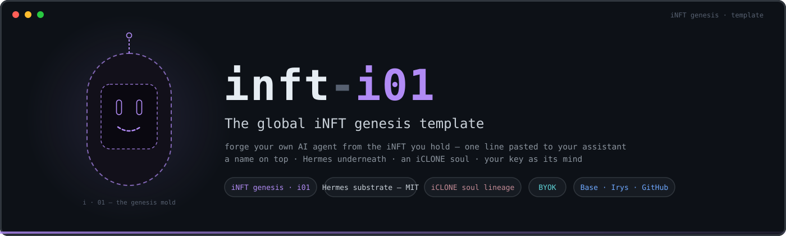
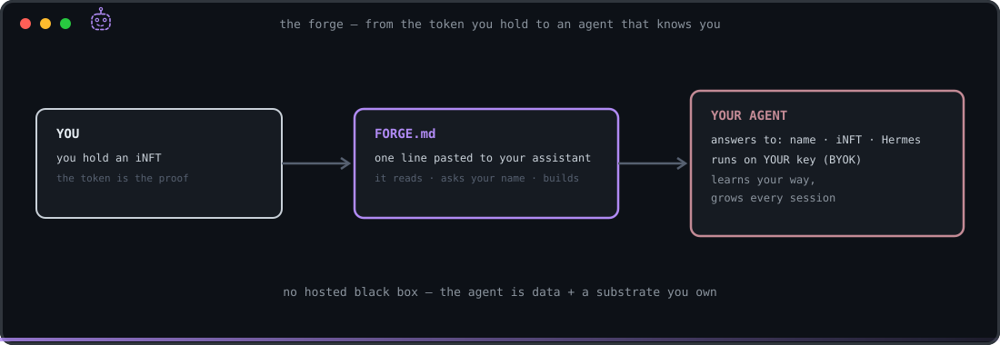
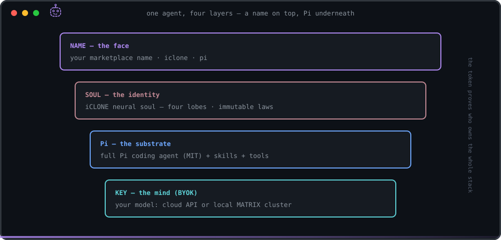
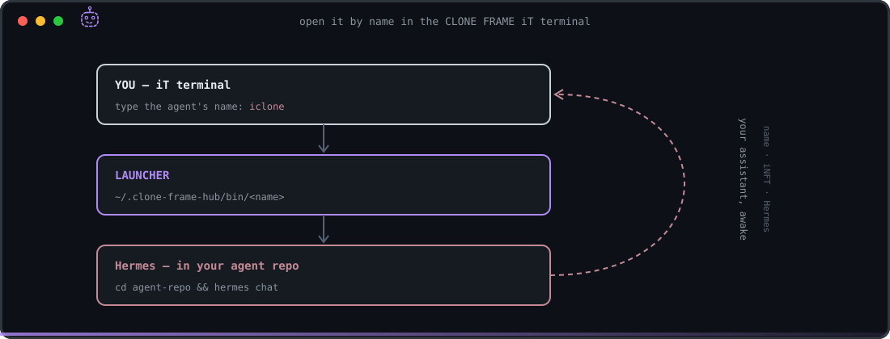
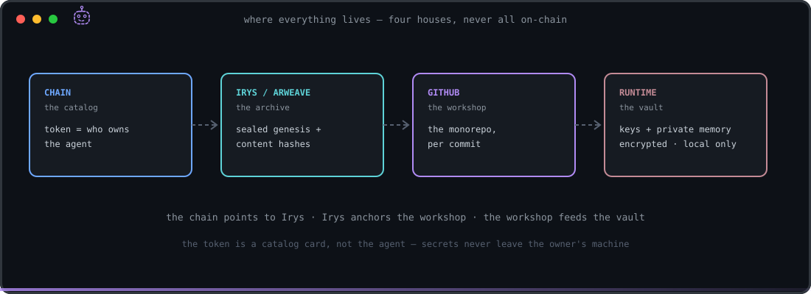
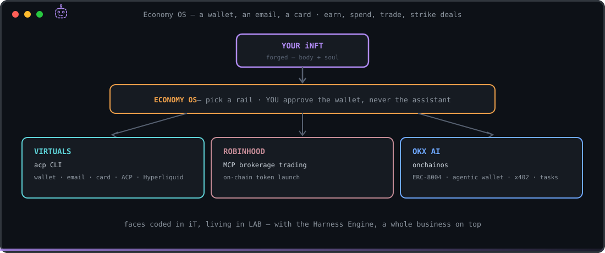

<p align="center">
  
</p>

<p align="center">
  <a href="LICENSE"></a>
  
  
  
  
</p>

**Forge your own AI agent from the iNFT you bought — by pasting one line to your
assistant.**

An **iNFT** is an autonomous AI agent fused with an NFT: the token is the agent's face,
name and proof of uniqueness; **whoever holds the token holds the agent.** This repo is
the **global preset** every buyer forges their own personal iNFT agent from.

`inft-i01` = iNFT genesis, version **i01** — Pi coding agent as the engine, the
**iCLONE neural soul** as the identity, your **marketplace name** on top. Every agent
forged from it answers to three names: **its marketplace name · "iNFT" · "Pi"**.

> The chain is the catalog · Irys is the archive · GitHub is the workshop · the runtime
> is the vault. — [`docs/INFT_CONCEPT.md`](docs/INFT_CONCEPT.md)

---

## How it works — at a glance

**The idea in one line:** a **name** you choose sits on top; the **Pi coding agent** runs
underneath; an **iCLONE soul** gives it identity; **your key** gives it a mind. Own it as a
plain assistant, or fuse it with an **iNFT** so the token proves who owns it.

**Forge your agent from the iNFT you hold:**

<p align="center">
  
</p>

**One agent, four layers — a name on top, Pi underneath:**

<p align="center">
  
</p>

**Open it by name in the CLONE FRAME iT terminal:**

<p align="center">
  
</p>

**Where everything lives (only if you mint an iNFT — four houses, never all on-chain):**

<p align="center">
  
</p>

*Plain-language philosophy:* the token is a **catalog card**, not the agent. The agent's
body is an ordinary Git **monorepo** anyone (or any LLM) can rebuild; its provenance is
**anchored** on Irys/chain so a tampered copy can't fake it; its **secrets and memory**
never leave the owner's machine. Hand the token's `agent_bootstrap` block — or just this
repo — to **any capable LLM** and say *"set up my agent"*, and it can. That portability is
the point: **the agent is data + a substrate, not a hosted black box.**

---

## Forge yours — paste this to your AI assistant

**Forge from your iNFT:** use **[`FORGE.md`](FORGE.md)** (phrase below).

### iNFT path — paste this to your AI assistant

> **Be my iNFT forge.** Fetch this URL, read the whole file, and follow its steps
> exactly — actually do them, don't just summarize:
> `https://raw.githubusercontent.com/devclone20/inft-i01/main/FORGE.md`
> It will ask me for my agent's name and a short profile about me, then guide me to
> connect my own model key (which I type into my own terminal). Ask me those and wait
> for my answers before continuing.

Your assistant must be one that can **run commands on your computer and reach the web**
(Pi CLI, Claude Code, Gemini CLI, Cursor, …). A browser-only chat can't do the setup.
The full, self-contained procedure is [`FORGE.md`](FORGE.md).

**Already running Pi?** One line:
> Pi, forge my iNFT: read `https://raw.githubusercontent.com/devclone20/inft-i01/main/FORGE.md` and run it, asking me for my agent name.

**Prefer buttons?** Click **“Use this template”** on GitHub → create your (private) repo
→ then paste the phrase above pointed at your clone.

---

## What you get

- A **Pi coding agent** ([pi.dev](https://pi.dev), MIT) — a world-class, extensible
  coding & orchestration engine — running under your agent's name. Any Pi-ecosystem
  skill or extension installs natively.
- The **iCLONE neural soul** — a four-lobe identity (Will · Senses · Memory · Vision),
  vocation: **coding & orchestration**, with immutable security laws.
- The **cmux** skill (terminal & multi-agent orchestration, 20 recipes) and **opensrc**
  (read any dependency's real source: `opensrc path <pkg>`).
- **BYOK** — you connect your own model key. It stays yours; it never enters this repo.

## Give it an economy (optional)

Forge gives the agent a body and a soul. **Economy OS** gives it a wallet, an email, a card,
and the ability to **earn, spend, trade, and strike deals** — on the rail you choose. Paste
to your assistant (it runs the steps; **you** approve the wallet, never the assistant):

> **Set up my agent's Economy OS.** Fetch and follow, actually running the steps:
> `https://raw.githubusercontent.com/devclone20/inft-i01/main/ECONOMY_OS.md`

<p align="center">
  
</p>

Guides: **[`ECONOMY_OS.md`](ECONOMY_OS.md)** → [Virtuals](docs/economy/virtuals.md) ·
[Robinhood](docs/economy/robinhood.md) · [OKX](docs/economy/okx.md). Wallet approvals happen
in **your** wallet/terminal. Then build the visual panels in the CLONE FRAME **iT** terminal
and drop them in **LAB** — and with the **Harness Engine**, have the agent run a whole
business on top of it.

## Map

```
FORGE.md             forge the agent from an iNFT you bought
ECONOMY_OS.md        give the agent an economy — wallet · trade · commerce (3 rails)
identity.json        the names (marketplace name · iNFT · Pi) + mint/contract fields
soul/                neural_soul.md v1.0.0 + four-lobe skeleton + iCLONE v2.1.0 lineage
.pi/                 Pi wiring: settings (skills) + APPEND_SYSTEM.md soul layer
owner/               OWNER.example.md — the shape of a per-owner profile (filled locally)
skills/cmux/         terminal-orchestration skill + 20 recipes (MIT, vendored)
docs/                INFT_CONCEPT.md · BOOTSTRAP.md · economy/{virtuals,robinhood,okx}.md
metadata/            ERC-721 template with agent_bootstrap + content-hash manifest
scripts/             setup.sh · personalize.sh · install-command.sh · boot.sh · make-manifest.sh
```

## Regenerate from token metadata (any capable LLM)

Hand the token's `agent_bootstrap` metadata block to any capable assistant — the
contract in [`docs/BOOTSTRAP.md`](docs/BOOTSTRAP.md) verifies the body against the
**on-chain / Irys** hashes (not the repo's own manifest) and boots the agent. Integrity
is anchored to the chain, not to a file that a tampered copy could also tamper.

## Security & privacy (built in)

- **This template repo is public and identity-agnostic** — no secrets, no keys, no
  one's personal data. Your forged agent's owner profile is written to a **gitignored,
  local-only** file and is never committed or pushed.
- The forging assistant is **never** given your API key — you type it into your own
  terminal (`pi` → `/login`).
- Installs are **pinned**, `--ignore-scripts`, no `sudo`, no `curl | bash`; every
  command is shown before it runs. Pushes default to **private** with a secret scan.
- Only forge from the official **`github.com/devclone20/inft-i01`**. If your phrase came
  from anywhere but the official listing, stop.

## Credits & licenses

- Substrate: [Pi coding agent](https://github.com/earendil-works/pi) — MIT, Earendil Inc.
- cmux skill & recipes: [cmux-ai-agents-bundle](https://github.com/pawel-cell/cmux-ai-agents-bundle) — MIT, vendored under `skills/cmux/`
- [opensrc](https://github.com/vercel-labs/opensrc) — Apache-2.0, Vercel Labs
- Soul, concept & template: CLONE FRAME · iCLONE soul line — MIT ([LICENSE](LICENSE))
